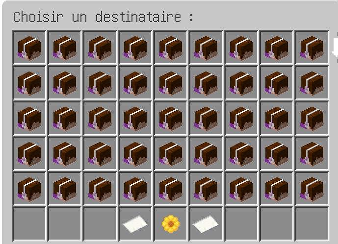
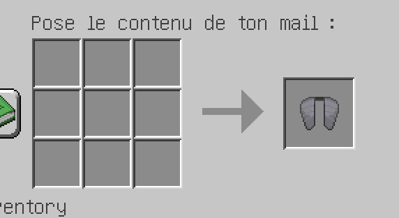
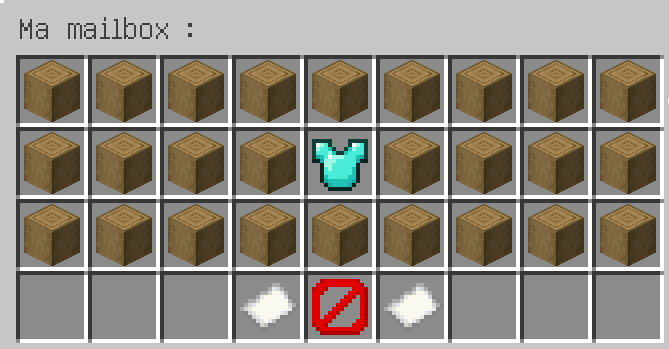
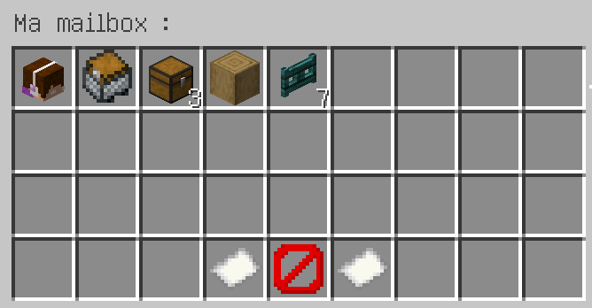
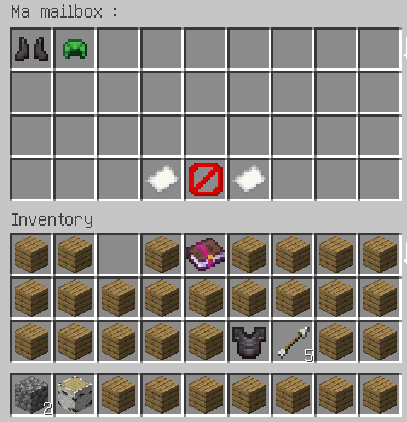
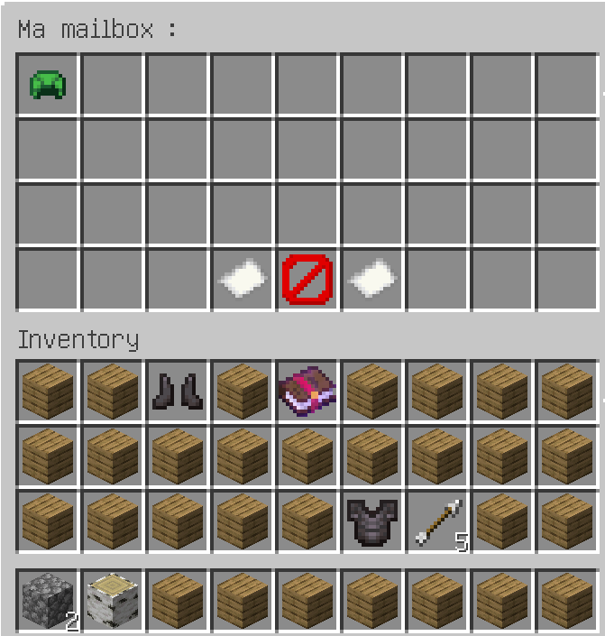
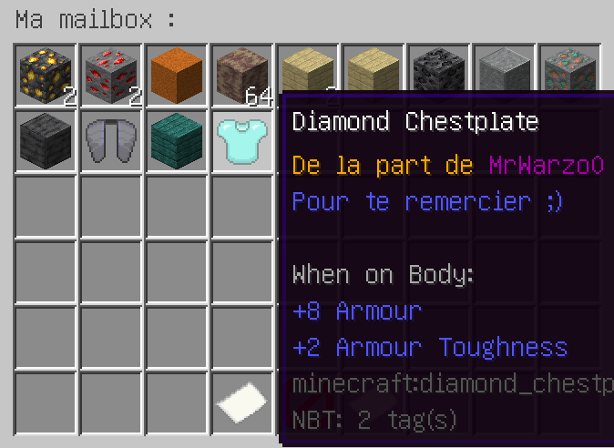

# MailBoxes

### Envoi d'items
Liste des possibles destinataires

Boite pour l'envoi du message
 
Items recus dans la box et pagination 
(page 1)

(page 2)

### Récupération d'items
Deux items dans la box

Messages dans le chat lors de la récupération (avec place puis sans place).

Item récupéré, disparait de la box?

Lore et destinataire.

